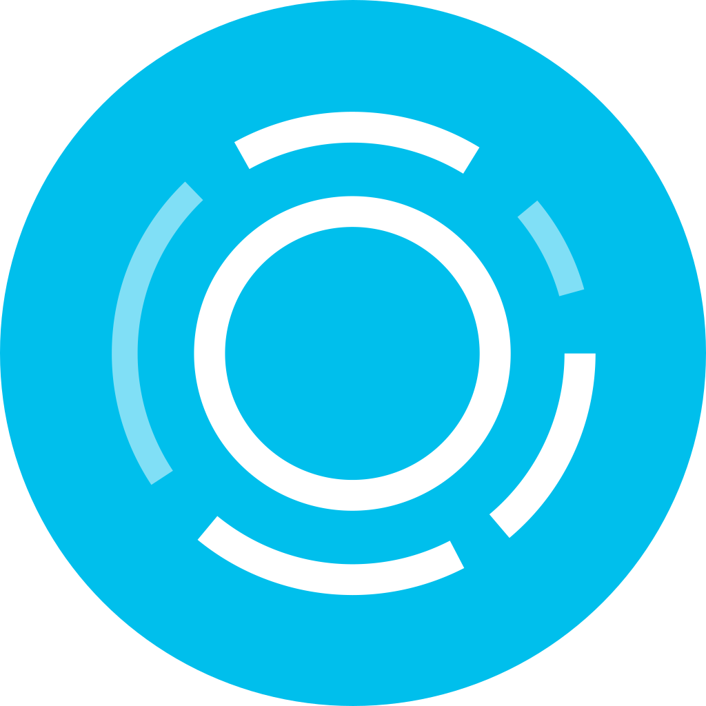

<body>
  

    <h1> Nexa AI</h1>
    

      Nexa AI is an intelligent chat assistant powered by <b>OpenAI’s GPT-4o mini model</b>, built with a 
      <b>React.js frontend</b>, <b>Node.js backend</b>, and <b>MongoDB database</b>.  
      It provides users with a smooth, responsive, and modern chat interface while storing and managing conversations efficiently.
    

    <h2>🚀 Features</h2>
    <ul>
      <li>AI-powered conversational assistant using GPT-4o mini</li>
      <li>Chat history management with create, switch, and delete options</li>
      <li>Modern and responsive UI built in React.js</li>
      <li>Fast and scalable backend powered by Node.js & Express</li>
      <li>Persistent data storage with MongoDB</li>
      <li>Secure handling of API keys via environment variables</li>
      <li>Delete threads individually without affecting others</li>
      <li>Fixed sidebar with history and credits section</li>
    </ul>
    <h2>🛠️ Tech Stack</h2>
    <ul>
      <li><b>Frontend:</b> React.js, Tailwind CSS (or custom CSS)</li>
      <li><b>Backend:</b> Node.js, Express.js</li>
      <li><b>Database:</b> MongoDB (Atlas / Local)</li>
      <li><b>AI Model:</b> GPT-4o mini (via OpenRouter / OpenAI API)</li>
    </ul>
    <h2>📂 Project Structure</h2>
    <pre><code>
    NexaAI/
│── backend/           # Node.js + Express server
│   ├── routes/        # API routes for threads & chat
│   ├── models/        # Mongoose schemas
│   ├── controllers/   # API logic
│   └── server.js      # Entry point for backend
│
│── frontend/          # React.js app
│   ├── src/
│   │   ├── components # UI components (Sidebar, Chatbox, etc.)
│   │   ├── assets/    # Images, logos
│   │   ├── App.js     # Main React app
│   │   └── index.js   # Entry point
│
│── .env               # Environment variables (API keys, DB URI)
│── package.json       # Project dependencies
│── README.html        # Documentation
    </code></pre>
    <h2>⚙️ Installation & Setup</h2>
    <h3>1. Clone the repository</h3>
    <pre><code>git clone https://github.com/yourusername/nexa-ai.git
cd nexa-ai</code></pre>
    <h3>2. Backend Setup</h3>
    <pre><code>cd backend
npm install</code></pre>
    
Create a <code>.env</code> file in <code>backend/</code>:

    <pre><code>MONGO_URI=your_mongodb_connection_string
OPENAI_API_KEY=your_openai_api_key
PORT=5000</code></pre>
    
Run the backend server:

    <pre><code>npm start</code></pre>
    <h3>3. Frontend Setup</h3>
    <pre><code>cd frontend
npm install
npm start</code></pre>
    
The app will be available at: <b>http://localhost:3000</b>

    <h2>📌 Roadmap</h2>
    <ul>
      <li>[ ] Add authentication (login & signup)</li>
      <li>[ ] Export chat history as PDF/Markdown</li>
      <li>[ ] Support for multiple AI models</li>
      <li>[ ] Dark/Light theme toggle</li>
      <li>[ ] Deployment on Vercel (frontend) & Render/Heroku (backend)</li>
    </ul>
    <h2>🤝 Contributing</h2>
    
Pull requests are welcome! For major changes, please open an issue first to discuss what you’d like to change.

    <h2>📜 License</h2>
    
This project is licensed under the <b>MIT License</b>.

    <footer>
      
👨‍💻 Developed by <b>Sahil Jadhav</b>

      
All Rights Reserved © Nexa AI 2025

    </footer>
  

</body>
</html>
